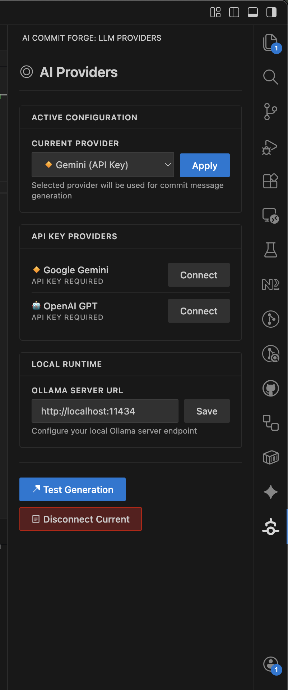
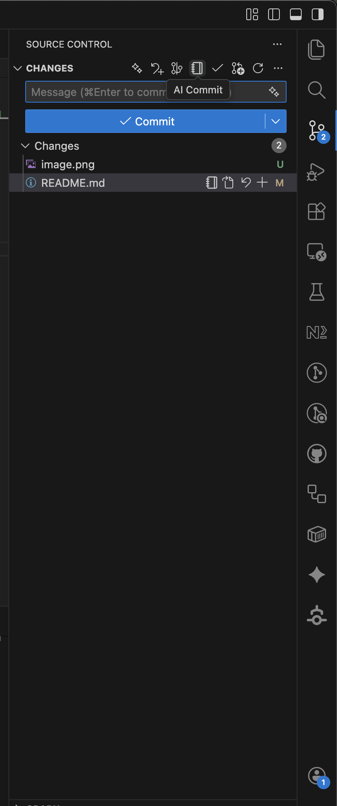

# AI Commit Forge

[](https://marketplace.visualstudio.com/items?itemName=abenkarroum.ai-commit-forge)
[](https://www.typescriptlang.org/)
[](LICENSE)

AI Commit Forge helps you write better commit messages. It looks at your staged changes and suggests a short, clear message.





## Features

- **Providers**: OpenAI, Google Gemini, or local Ollama
- **Real diffs**: Messages are based on what actually changed
- **VS Code integration**: Inserts the message into the Git box for you

## Installation

Marketplace:

1. Open VS Code → Extensions
2. Search "AI Commit Forge"
3. Install

VSIX:

1. Download the `.vsix`
2. Run "Extensions: Install from VSIX..."

**Install from source (build + package + install):**

For a smooth one-step build and install when developing or installing from the repo:

```bash
./bootstrap.sh
```

This script cleans previous builds, compiles the extension, packages it as a `.vsix`, and installs it into VS Code (`code --install-extension`). Ensure `code` is on your `PATH` (e.g. install the "code" command from the Command Palette: "Shell Command: Install 'code' command in PATH").

## Quick Start

1. Open the AI Commit Forge sidebar
2. Connect a provider:
   - OpenAI or Gemini: click Connect and paste your API key
   - Ollama: set your server URL (default `http://localhost:11434`)
3. Set it as the active provider
4. Stage your files in Git
5. Run "AI Commit Forge: Generate" (SCM button or Command Palette)

## Providers

| Provider         | Auth    | Notes                         |
| ---------------- | ------- | ----------------------------- |
| 🔸 Google Gemini | API Key | Fast and concise              |
| 🤖 OpenAI GPT    | API Key | High quality                  |
| 🏠 Ollama        | Local   | Works offline on your machine |

## Settings

| Setting                         | Type   | Default                    | Description       |
| ------------------------------- | ------ | -------------------------- | ----------------- |
| `aiCommitHelper.activeProvider` | string | `"gemini"`                 | Current provider  |
| `aiCommitHelper.ollama.url`     | string | `"http://localhost:11434"` | Ollama server URL |

You can change these in Settings → Extensions → AI Commit Forge or in `settings.json`.

## Commands

| Command                                  | Description                                 |
| ---------------------------------------- | ------------------------------------------- |
| AI Commit Forge: Generate                | Creates a commit message for staged changes |
| AI Commit Forge: Open Provider Config    | Opens the sidebar                           |
| AI Commit Forge: Test Message Generation | Quick provider test                         |

## Requirements

- VS Code 1.80+
- Git installed
- Internet for API providers (not required for Ollama)

## Troubleshooting

- "No staged files" → Stage files first (`git add`)
- "No Git repo" → Run `git init` in your workspace
- API key errors → Re-enter the key in the sidebar
- Ollama issues → Ensure `ollama serve` is running and the URL is correct

## Contributing

PRs are welcome. Typical flow:

```bash
git clone https://github.com/abenkarroum/ai-commit-forge.git
cd ai-commit-forge
npm install
# F5 in VS Code to run the Extension Development Host
# Or run ./bootstrap.sh to build, package, and install the extension
```

## License

MIT — see [LICENSE](LICENSE).
